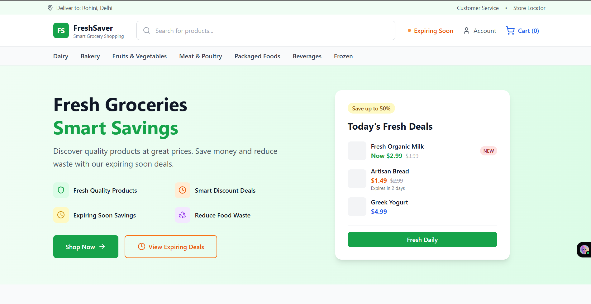
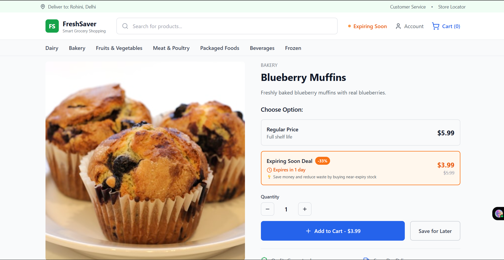

# 🛒 Grocery Dynamic Pricing Website

🔗 **Live Link:** [https://ecommerce-seven-kappa-37.vercel.app//](https://ecommerce-seven-kappa-37.vercel.app/)




---

## 🎯 Overview

A grocery e-commerce website with dynamic pricing for perishable items (i.e., near-expiry stock).  
The experience feels familiar and clean, intelligently surfacing discounted near-expiry items without being intrusive.

---

## 🚀 Problem

- Perishable items often go unsold and are wasted  
- Static pricing doesn't adapt to expiry timelines  
- Shoppers lack visibility into near-expiry deals

---

## 💡 Solution

Smart product pages and pricing flow with:

- ✅ Default display of standard product pricing  
- ✅ Small visual cue for near-expiry versions (badge or icon)  
- ✅ Near-expiry deal visible only on product detail page  
- ✅ Dedicated "Expiring Soon" page to view all discounts

---

## 🛠️ Tech Stack

- **React / Next.js / Vite**  
- **TailwindCSS / Vanilla CSS**  
- **Mock Data in JSON** format for simulation

---

## 🚀 Quick Start

```bash
cd grocery-dynamic-pricing
npm install
npm run dev

Then open your browser at: http://localhost:3000
```
